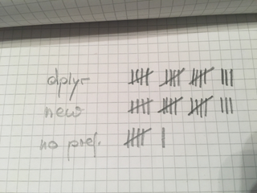

# This is what you said

```{r setup, include=FALSE}
knitr::opts_chunk$set(echo = TRUE)
```



--

**What we will do:** work quickly through rest of  dplyr slides, and then start new material

---

# Weather the weather?

Temperatures are projected to be around -60F on Wednesday (factoring in wind chill) 

5 mins of exposed skin will result in frost bite

my personal nightmare scenario: classes get cancelled during our lab because CyRide stops, and we are all stranded

--

**What we will do:**

if  ISU cancels classes, we do our lab on Monday next week

if ISU does not cancel classes, we do the lab remotely from a safe place (Dr Hofmann will be in the lab)

---

# Getting ready for the lab

[lab #1](../labs/01_lab.html) is now posted

We will work through the first question to get ready to do the rest
