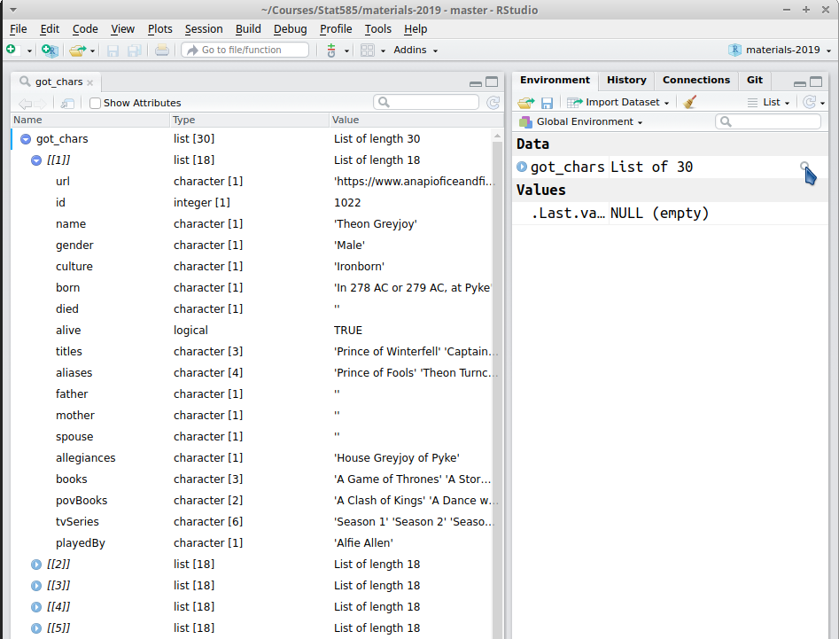

class: center, middle


```{r setup, include=FALSE}
options(width = 60)
knitr::opts_chunk$set(echo = TRUE)
```

# Data Types

---

## Basic Data Types

Name | Example
---- | -------
numeric | 2.93
integer | 2
character | "hello world"
logical | TRUE

Convert between data types with `as.XXX`, e.g. `as.numeric("2.394")` or `as.character("3.14159")`

Test whether something has a data type with `is.XXX`, e.g. `is.character("fuzzy puppies")` or `is.logical("abcde")`

---

## Basic Data Structures

Data structures hold one or more basic data types and may have multiple dimensions:

   | One type | Multiple Types
-- | -------- | --------------
1D | Atomic vector | List
2D | Matrix | Data frame
nD | Array | 

An individual value ("scalar" in other languages) is a length one vector in R

---

## Basic Data Structures

`str()` can be used to examine a variable and determine its structure:

```{r, include = F}
library(tidyverse)
```

```{r, eval = -1}
library(tidyverse)
data("mtcars")
str(mtcars)
```
---

## Basic Data Structures

`str()` can be used to examine a variable and determine its structure:
```{r}
data("eurodist")
str(eurodist)
```
---

## Basic Data Structures

`str()` can be used to examine a variable and determine its structure:
```{r}
data("discoveries")
str(discoveries)
```
---

## Basic Data Structures

`str()` can be used to examine a variable and determine its structure:
```{r}
data("occupationalStatus")
str(occupationalStatus)
```
---

## Basic Data Structures

`str()` can be used to examine a variable and determine its structure:
```{r}
str(c(5:15))
str(month.name)
str(3)
str(mean)
```

---
class: center, middle
# Factors

---

## Factors

Some data has both names and a defined numerical ordering:
```{r}
month.name
```

Factors are used to store both the numerical values and the associated labels:
```{r}
factor(month.name)
```

By default, R uses alphabetical order for factors...

---

## Factors
```{r}
factor(month.name)
```

By default, R uses alphabetical order for factors...

Set level names to override the default ordering 
```{r}
months <- factor(month.name, levels = month.name)
months
```


---

## Factors

You can access the labels of a factor using `levels()`
```{r}
levels(months)
```

You can access the order of the factor using `as.numeric()`:
```{r}
as.numeric(months)
```

---

## Type Conversions
```{r}
# Get a numeric vector
x <- sample(1:10, 5)
x
# Create factor from numeric vector
fac_x <- factor(x)
fac_x

# Convert factor to numeric
as.numeric(fac_x) # Huh?
```
`as.numeric()` converts factors to their level numbers, not to their labels

---

## Type Conversions

```{r}
as.character(fac_x)
as.numeric(as.character(fac_x))
```
`as.character()` extracts the labels; you can then use `as.numeric` to get the labels' numeric value.

---
class:center, middle
# Lists

---

## Data frames

```{r}
simple_df <- data.frame(letters = letters, order = 1:26)
str(simple_df)

mode(simple_df)
```

Data frames are lists of vectors where each vector is constrained to have the same length

---

## "Hidden" Lists

We could convert the data frame to a list by changing its class:

```{r}
class(simple_df) <- "list"
simple_df
```

---

## Examining Lists
```{r}
library(repurrrsive)
data(got_chars) # Game of Thrones characters
str(got_chars)
```

---

## Examining Lists

RStudio has a built-in list viewer


---

## Extracting Elements from Lists

```{r, collapse=TRUE}
theon <- got_chars[[1]] # Gets 1st list element
str(theon) 
```

---

## Extracting Elements from Lists

```{r, collapse=T}
# Extracting elements by name:
theon[["tvSeries"]]
theon["culture"]
theon$alive
```

```{r, collapse=T}
# Extracting elements by position: 
theon[[3]]
theon[3:5]
```

---

## Indexing

So [what's the difference](https://cran.r-project.org/doc/manuals/R-lang.html#Indexing) between `x$.`, `x[[.]]` and `x[.]`?

`x[[.]]`
- Returns a single element
- Selection by numerical or character index

`x[.]`
- Returns a list
- Allows indexing by vectors

`x$.`
- Returns a list component
- Indexing by component name (doesn't work on unnamed lists)

---

## Extracting Elements from Lists
The `magrittr` package contains a collection of pipe-friendly replacements for base R functions.

```{r, echo = -1}
suppressPackageStartupMessages(library(magrittr))
library(magrittr)
got_chars %>%
  extract2(1) %>% # extract2 is the pipe version of [[.]]
  extract(3) # extract is the pipe version of [.]

# unlist() creates a vector from a list by concatenating 
# and type-converting the list elements
got_chars %>% extract2(1) %>% extract(c(3, 10)) %>% unlist()
```

---
class: inverse
## Your Turn

Explore the `got_chars` object from the `repurrrsive` package. 

```{r, eval = -1}
devtools::install_github("jennybc/repurrrsive")
library(repurrrsive)
data("got_chars")
```

1. Can it be converted to a data frame? Why or why not?

2. Use base R operators (`[[`, `[`, and `$`) to determine who the 8th character in the list is, and what their allegiance is.

3. Use `magrittr` operators (`extract2` and `extract`) to determine who the 5th character in the list is, and whether they are currently alive.

---

## Working with Lists

The `purrr` [package](http://purrr.tidyverse.org/) contains tools for working with lists more easily. It is part of the tidyverse. 

Purrr functions operate by applying a function to every element (or chunk) of a list or data frame. 
`map` is the basic function and returns the function's results as a list (by default). 

```{r, echo = -1}
suppressPackageStartupMessages(library(purrr))
library(purrr)

# Get the length of each list in got_chars
map(got_chars, length) 
```

---

## Working with Lists

Specify the type using `map_int`, `map_chr`, `map_df`, and others

```{r}
map_int(got_chars, length)

# Map names() to a data frame column
map_dfc(got_chars, names)
```

---

## Working with Lists

Purrr comes with a few shortcuts, too:

```{r}
# For each element in got_chars, get the "name" element
map_chr(got_chars, "name")
```

---

## Working with Lists

Purrr comes with a few shortcuts, too:

```{r}
# For each element in got_chars, get the 1st element
map_chr(got_chars[1:5], 1)
```

---
class:inverse
## Your Turn

The `gh_users` data in the `repurrrsive` package has information about 6 github users. 

```{r}
library(dplyr)
library(purrr)
library(repurrrsive)
data(gh_users)
```

1. Assemble a data frame of github users column-by-column using appropriate `map_*` functions. Which columns cannot be easily included? (You can skip most of the url columns to save time)

```{r}
data.frame(
  login = map_chr(gh_users, "login"),
  id = map_chr(gh_users, "id"),
  avatar_url = map_chr(gh_users, "avatar_url"), 
  gravatar_id = map_chr(gh_users, "gravatar_id"), 
  url = map_chr(gh_users, "url"),
  html_url = map_chr(gh_users, "html_url"),
  followers_url = map_chr(gh_users, "followers_url"), 
  following_url = map_chr(gh_users, "following_url"), 
  repos_url = map_chr(gh_users, "repos_url"),
  events_url = map_chr(gh_users, "events_url"),
  
  
)

```
2. How many of the github users indicate that they are hireable?

