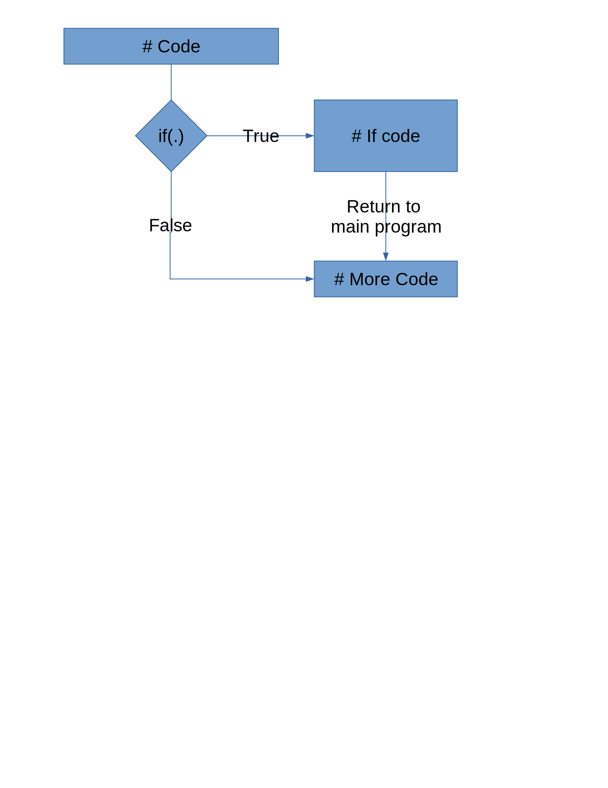

class: center, middle

```{r setup, include=FALSE}
options(htmltools.dir.version = FALSE)
```

# Functions


---

## Functions in R

- We use functions all the time

- What if there isn't a built-in or package function?

- Idea: avoid repetitive coding (errors, hard to maintain)

- Instead:

--

  - Extract common operations
  
--

  - Wrap in a function
  
--

  - Reuse
  
---

## Basic Structure

- Name
- Input arguments
  - names
  - default value
- Body
- Output values

---

## A first function

```{r firstfunction, echo = T, eval = F}
mean <- function(x) {
  return(sum(x)/length(x))
}

mean(1:15)
mean(c(1:15, NA))

mean <- function(x, na.rm = F) {
  # If na.rm is T, delete the missing value from x
  
  return(sum(x)/length(x))
}
```

---

## Conditionals

```{r conditionals, eval = F}
if (condition) { # only one set of commands  
  statement      # is executed depending on 
} else {         # whether condition is true
  statement      # or false
}
```

- Condition is a length one logical value (TRUE or FALSE)
- Use & and | to combine several conditions
- ! negates a condition (!FALSE is TRUE)

---

## Conditionals - if()



---

## Conditionals - ifelse 


---

## A first function

```{r first-function-2}
mean <- function(x, na.rm = F) {
  if (na.rm == TRUE) {
    x <- na.omit(x)
  }
  
  return(sum(x)/length(x))
}

mean(1:15)
mean(c(1:15, NA), na.rm = F)
mean(c(1:15, NA), na.rm = T)
```

---

## Function `mean`

|     |     |
| --- | --- |
| Name | `mean` |
| Input arguments | `x, na.rm = T` |
|                 | names, default values | 
| Body | `if (na.rm) x <- na.omit(x)` | 
| Output | `return(sum(x)/length(x))` |

---

## Function Writing

- Start simple, then extend

- Test out each step

- Don't try too much at once


---
class: inverse
## Your turn

- Write a function `sd` that computes the standard deviation of `x` "from scratch". Include a parameter `na.rm` in it

- $L(\lambda; x) = -n\lambda + log(\lambda) \cdot\sum x_i$ is the log likelihood function of a Poisson variable x with parameter $\lambda > 0$
  - Write a function `loglikpois` with parameters `lambda` and `x` (a vector) that computes the log likelihood value for lambda given observations `x`.
  - Make sure to check that `lambda` is positive; return an error message (using `stop()`) if it is not.
  - Plot the likelihood values for lambda between 0 and 10 for `x = c(1, 3, 2, 3, 0, 1, 0, 1, 3, 3)`
  
---

## Good Practice

- Use tabs to structure blocks of statements

- Build complex blocks of codes step by step
    - A function should complete one task
    - Chain multiple functions together with a meta-function for more complex tasks

- `# write comments!`


---

## Testing

- Always test your functions!
    - Check input types - #1 source of issues

- Even better: Have someone else test them for you

---

## When Things Go Wrong...

Debugging is an art, not a science

- By yourself
  - check your code step by step
  - explain your code to an inanimate object    
  .small[(traditionally, a rubber duck)]
  - include print statements to check intermediate results and assumptions
  - use `browser()`
  - investigate all warnings
  
- Ask a friend to look over your code <div style='position:relative; padding-bottom:calc(51.54% + 44px)'><iframe src='https://gfycat.com/ifr/ShockedSmoggyAnkole' frameborder='0' scrolling='no' width='50%' height='50%' style='position:absolute;top:0;left:0;' allowfullscreen></iframe></div><p></p>


---
class: inverse
## Globe at Night
- Program of the National Optical Astronomy Observatory

- Observers report on visibility of constellations on pre-determined days

- http://www.globeatnight.org/maps.php

### Your Turn

- Download the data for 2018 and 2017 using R

- How could you automate the download?

- Advanced: Write a loop to download the data since 2006 and merge it into a single file

---

## Iterations

- Run the same block of code multiple times:
```{r iterations1, eval = F}
for (i in players) {
  #####################
  # Block of commands #
  #####################
  
  # Output
}
```

--

This is a loop, or iteration

---

## Iterations

- Run the same block of code multiple times:
```{r iterations2, eval = F}
for (i in players) {
  #####################
  # Block of commands #
  #####################
  
  print(avg)
}
```

--

This is a loop, or iteration

---

## Iterations

- Run the same block of code multiple times:
```{r iterations3, eval = F}
for (i in players) {
  
  player <- subset(baseball, playerID == i)
  avg <- sum(H/AB, na.rm = T)
  
  print(avg)
}
```

--

This is a loop, or iteration

---

## Iterations and R

- R is vector-based - many tasks don't require loops at all

- `for` loops are useful for debugging purposes

- The `apply` series of functions (`lapply`, `sapply`, `mapply`, `tapply`) can be used to "loop" in R without an explicit for loop

- `purrr` is a tidyverse package used for functional programming
    - tidy version of `apply`: `map`
    - more consistent API


---
class: inverse
## Your Turn

[FizzBuzz](http://www.dr-mikes-math-games-for-kids.com/fizz-buzz.html) is a common game to teach children multiplication tables

Write a function that, for any lower bound $a$ and upper bound $b$, outputs the correct response to FizzBuzz:
- if the number is divisible by 3, the program returns "fizz" instead of the number
- if the number is divisible by 7, the program returns "buzz" instead of the number
- if the number is divisible by 3 and 7, the program returns "fizzbuzz" instead of the number

The modulus operator, `%%` will be useful.

1. Write a fizzbuzz function using a `for` loop

2. Can you make your function work without using a loop?


